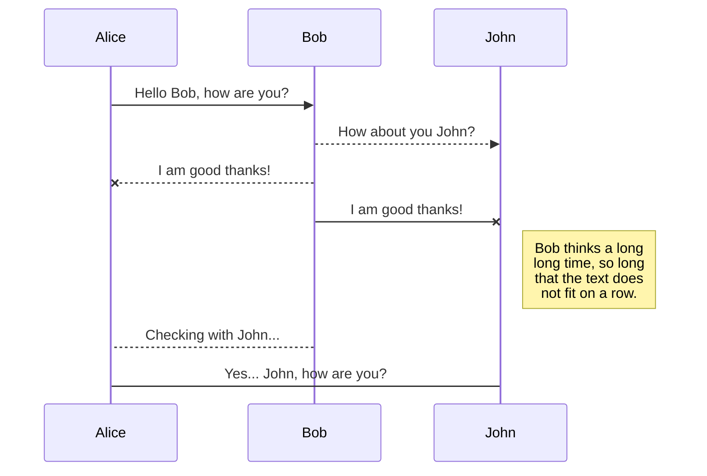
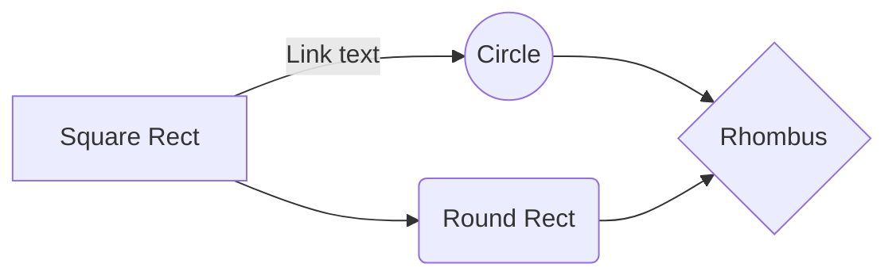

# Project Bonsai

Project Bonsai does all the heavy lifting of creating a secure and modern Wordpress website for you. It is a custom configuration of Wordpress, Roots, Trellis, Bedrock, Sage, Bootstrap, Vagrant, and other open source projects.

### Tutorial
Trello board: [Speed Run](https://trello.com/invite/b/gtpcYNvC/961d55ce28eeb7a573be8914df41c797/bonsai-speed-run)

For a video tutorial on creating a Bonsai project from scratch, go to  the [official website](https://bonsai.jackalope.io) or our [Youtube channel](https://www.youtube.com/user/JackalopeMedia/).

# Quick Setup

We're going to take a few minutes to setup all the requirements to ensure that deploying Project Bonsai goes smoothly:

## Download Bonsai

Download project Bonsai from the [official website](https://bonsai.jackalope.io) or from the [github repository](https://github.com/jackalopeio/bonsai/).

Don't forget to move Bonsai from your downloads folder into your `~/Sites` directory. 

To download with the command line, run:
 `cd ~/sites` and `git clone https://github.com/jackalopeio/Bonsai.git`

## Requirements

### Create SSH Keys

 - To use [OpenSSH](https://www.digitalocean.com/docs/droplets/how-to/add-ssh-keys/create-with-openssh/), open terminal and run: `ssh key-gen`
 - Add public SSH key [to Github](https://github.com/settings/ssh/new)
 - Add public SSH key [to DigitalOcean](https://cloud.digitalocean.com/account/security)

### Install Requirements
**Shell Script:** If you're going to run Bonsai/site/scripts/requirements.sh for installation, don't forget to set permissions by running: 
`cd ~/sites/Bonsai/site/scripts && chmod -R 777 .`

 - [Install xcode dev tools](https://developer.apple.com/xcode/): `xcode-select --install`
 - [Update to PHP >=7.2](https://jasonmccreary.me/articles/upgrade-php-mac-os-x/)
 - [Homebrew](https://brew.sh/): `/bin/bash -c "$(curl -fsSL https://raw.githubusercontent.com/Homebrew/install/master/install.sh)"`
 - [Node](https://nodejs.org/en/download/): `brew install nvm`
 - [Ansible](https://hvops.com/articles/ansible-mac-osx/): `brew install ansible`
 - [Composer](https://getcomposer.org/download/): `brew install composer`
 - [Yarn](https://classic.yarnpkg.com/en/docs/install#mac-stable): `brew install yarn`
 - [Virtualbox](https://www.virtualbox.org/wiki/Downloads): `brew cask install --appdir="/Applications" virtualbox`
 - [Vagrant](https://www.vagrantup.com/downloads.html): `brew cask install --appdir="/Applications" vagrant`
 - [Vagrant Manager](https://github.com/lanayotech/vagrant-manager/releases): `brew cask install --appdir="/Applications" vagrant-manager`
 - [Atom](https://atom.io/): `brew cask install --appdir="/Applications" atom`
 - [iTerm2](https://www.iterm2.com/): `brew cask install --appdir="/Applications" iterm2`
 - Github Desktop App: `brew cask install --appdir="/Applications" github-desktop` 

You can rename the current file by clicking the file name in the navigation bar or by clicking the **Rename** button in the file explorer.

### First, Check

If you're recreating a project, you may want to check these things just to be sure:

 - Remove unnecessary Virtualbox machines
 - Clear: `~/.ssh/known_hosts`
 - Clear: `~/../../etc/hosts`

# Servers

By default, we use DigitalOcean base Ubuntu servers for Project Bonsai.

### Nameservers
First, you'll want to make sure that your Domain Registrant points towards [DigitalOcean](https://www.digitalocean.com/community/tutorials/how-to-point-to-digitalocean-nameservers-from-common-domain-registrars).

 - `ns1.digitalocean.com`
 - `ns2.digitalocean.com`
 - `ns3.digitalocean.com`

### Create Droplets
Create two base Ubuntu DigitalOcean Droplets. Link them to your SSH key.

### Setup DNS

 - Go to DigitalOcean's Dashboard > Networking
 - Add new domain or click on existing one
 - A Record: www.subdomain.domain.com
 - A Record: subdomain.domain.com
 - CNAME: *.subdomain.domain.com

### Configure etc/hosts
Add IP and domains to `etc/hosts`, run: `sudo vim ~/../../etc/hosts`
```
111.11.111.111 subdomain.example.com
555.55.555.555 example.com www.example.com
```
### Configure ~/.ssh/config
Add IP and hostname to `~/.ssh/config`, run: `sudo vim ~/.ssh/config`
```
Host bonsai-staging
        HostName 111.11.111.11
        Port 22
        User root
        IdentityFile ~/.ssh/id_rsa
        
Host bonsai-production
        HostName 555.55.555.555
        Port 22
        User root
        IdentityFile ~/.ssh/id_rsa
```
### Test SSH Connection
Make sure that your SSH connections are working by SSH'ing into the servers:

 - Staging, run: `ssh root@subdomain.example.com`
 - Production, run: `ssh root@example.com`

# Configure Bonsai

Synchronization is one of the biggest features of StackEdit. It enables you to synchronize any file in your workspace with other files stored in your **Google Drive**, your **Dropbox** and your **GitHub** accounts. This allows you to keep writing on other devices, collaborate with people you share the file with, integrate easily into your workflow... The synchronization mechanism takes place every minute in the background, downloading, merging, and uploading file modifications.

There are two types of synchronization and they can complement each other:

- The workspace synchronization will sync all your files, folders and settings automatically. This will allow you to fetch your workspace on any other device.
	> To start syncing your workspace, just sign in with Google in the menu.

- The file synchronization will keep one file of the workspace synced with one or multiple files in **Google Drive**, **Dropbox** or **GitHub**.
	> Before starting to sync files, you must link an account in the **Synchronize** sub-menu.

## Open a file

You can open a file from **Google Drive**, **Dropbox** or **GitHub** by opening the **Synchronize** sub-menu and clicking **Open from**. Once opened in the workspace, any modification in the file will be automatically synced.

## Save a file

You can save any file of the workspace to **Google Drive**, **Dropbox** or **GitHub** by opening the **Synchronize** sub-menu and clicking **Save on**. Even if a file in the workspace is already synced, you can save it to another location. StackEdit can sync one file with multiple locations and accounts.

## Synchronize a file

Once your file is linked to a synchronized location, StackEdit will periodically synchronize it by downloading/uploading any modification. A merge will be performed if necessary and conflicts will be resolved.

If you just have modified your file and you want to force syncing, click the **Synchronize now** button in the navigation bar.

> **Note:** The **Synchronize now** button is disabled if you have no file to synchronize.

## Manage file synchronization

Since one file can be synced with multiple locations, you can list and manage synchronized locations by clicking **File synchronization** in the **Synchronize** sub-menu. This allows you to list and remove synchronized locations that are linked to your file.


# Publication

Publishing in StackEdit makes it simple for you to publish online your files. Once you're happy with a file, you can publish it to different hosting platforms like **Blogger**, **Dropbox**, **Gist**, **GitHub**, **Google Drive**, **WordPress** and **Zendesk**. With [Handlebars templates](http://handlebarsjs.com/), you have full control over what you export.

> Before starting to publish, you must link an account in the **Publish** sub-menu.

## Publish a File

You can publish your file by opening the **Publish** sub-menu and by clicking **Publish to**. For some locations, you can choose between the following formats:

- Markdown: publish the Markdown text on a website that can interpret it (**GitHub** for instance),
- HTML: publish the file converted to HTML via a Handlebars template (on a blog for example).

## Update a publication

After publishing, StackEdit keeps your file linked to that publication which makes it easy for you to re-publish it. Once you have modified your file and you want to update your publication, click on the **Publish now** button in the navigation bar.

> **Note:** The **Publish now** button is disabled if your file has not been published yet.

## Manage file publication

Since one file can be published to multiple locations, you can list and manage publish locations by clicking **File publication** in the **Publish** sub-menu. This allows you to list and remove publication locations that are linked to your file.


# Markdown extensions

StackEdit extends the standard Markdown syntax by adding extra **Markdown extensions**, providing you with some nice features.

> **ProTip:** You can disable any **Markdown extension** in the **File properties** dialog.


## SmartyPants

SmartyPants converts ASCII punctuation characters into "smart" typographic punctuation HTML entities. For example:

|                |ASCII                          |HTML                         |
|----------------|-------------------------------|-----------------------------|
|Single backticks|`'Isn't this fun?'`            |'Isn't this fun?'            |
|Quotes          |`"Isn't this fun?"`            |"Isn't this fun?"            |
|Dashes          |`-- is en-dash, --- is em-dash`|-- is en-dash, --- is em-dash|


## KaTeX

You can render LaTeX mathematical expressions using [KaTeX](https://khan.github.io/KaTeX/):

The *Gamma function* satisfying $\Gamma(n) = (n-1)!\quad\forall n\in\mathbb N$ is via the Euler integral

$$
\Gamma(z) = \int_0^\infty t^{z-1}e^{-t}dt\,.
$$

> You can find more information about **LaTeX** mathematical expressions [here](http://meta.math.stackexchange.com/questions/5020/mathjax-basic-tutorial-and-quick-reference).


## UML diagrams

You can render UML diagrams using [Mermaid](https://mermaidjs.github.io/). For example, this will produce a sequence diagram:



And this will produce a flow chart:


